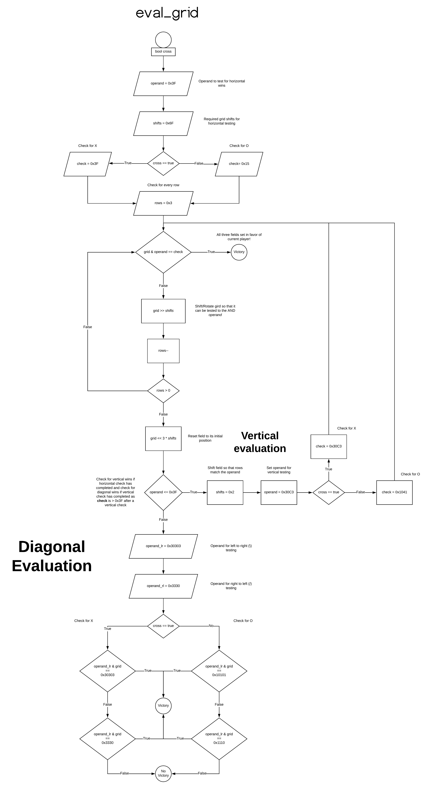

# eval_grid
> Source: [core.asm](/src/core.asm)

## Description

Evaluates the grid for victory.

## Parameters
|Register|Description                                                     |
|--------|----------------------------------------------------------------|
|RDI     |Player, where `0x0` checks for Circle and `0x1` checks for Cross|

## Returns

|RAX/Return Value|Evaluation |
|----------------|-----------|
|0x0             |No Victory |
|0x1             |Victory    |

## C Call
```C
bool eval_grid(bool cross);
```

## C Example

In the following example, we will test the grid for a X victory and announce it if player X has won.

```c
if(eval_grid(true))
{
  printf("Player X has won!")
}
```

## Assembly Example

In the following example, we will test the grid for a cross victory and jump to the `win` label if player cross has won.

```asm
mov   RDI, 0x1    ; Check for cross victory
call  eval_grid   ; Evaluate grid for victory

test  rax, rax    ; Check for victory
jne   victory     ; Jump to victory label if player X won
```

## Procedure Diagram

Full diagram may be accessed [here](https://www.lucidchart.com/documents/view/bcf46504-bd66-494e-897a-d69e0ca05095)



## Procedure Overview

eval_grid evaluates the grid for a total of three different victories:

### Horizontal Victory
First, the procedure checks the grid for a horizontal victory by testing each row to a bit mask of `0x3F` (which translates to `111111` in binary). If the evaluation is made for player O, the bitwise AND operation must match `0x15` to make for a horizontal victory. In contrast, if the evaluation is made for player X, the bitwise AND operation must match `0x3F` to make for a horizontal victory.

Each row is tested by rotating the grid by `0x6` to the right, thereby ensuring that the rows align with the `0x3F` bit mask.

If any of the rows match a victory, the procedure returns `0x1` on `RAX`.

In order to preserve the original state of the grid, rotating is only done to a mutable copy of the grid which is loaded into `RDX`, which can be safely discarded without affecting the actual allocated memory for the grid.

> See illustrated example bellow for a visual assistance.

### Vertical Victory

Should a horizontal victory not be present, the procedure will further test for a vertical victory. Each columns is tested against `0x30C3` (which translates to `11000011000011` in binary). If the evaluation is made for player O, the bitwise AND operation must match `0x1041` to make for a vertical victory. In contrast, if the evaluation is made for player X, the bitwise AND operation must match `0x30C3` to make for a vertical victory.

Similar to horizontal testing, each column is tested by rotating the grid by `0x2` to the right, thereby ensuring that the columns align with the `0x30C3` bit mask.

If any of the columns match a victory, the procedure returns `0x1` on `RAX`.

### Diagonal Victory

Once again, should a vertical victory be absent, the procedure will test for a diagonal victory. Unlike horizontal and vertical victories, no rotations are applied to the grid. Instead, the procedure evaluates for a diagonal spanning from the top left to the bottom right, and a diagonal spanning from the bottom left to the top right.

For a top left to bottom right victory, the field is tested against `0x30303` (which translates to `110000001100000011`), where the bitwise AND operation must return `0x10101` for a Circle win, and `0x30303` for a cross win.

For a bottom left to top right victory, the field is tested against `0x3330` (which translates to `11001100110000`), where the bitwise AND operation must return `0x1110` for a Circle win, and `0x3330` for a cross win.

---

To be done...
