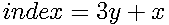
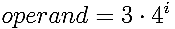

# get_field
> Source: [core.asm](/src/core.asm)

## Description

Obtains the state of the field at position x and y.

## Parameters
|Register|Description   |
|--------|--------------|
|RDI     |X Co-ordinates|
|RSI     |Y Co-ordinates|

## Returns

|RAX/Return Value|Field State|
|----------------|-----------|
|0x0             |Cross      |
|0x1             |Circle     |
|0x2             |Empty      |

## C Call
```C
uint8_t get_field(uint8_t x, uint8_t y);
```

## C Example

In the following example, we will test the middle field and print a message describing its current state:

```c
switch(get_field(1, 1)) // Co-ordinates start at 0!
{
  case 0x0 :
    printf("Field set to X\n");
    break;

  case 0x1 :
    printf("Field set to O\n");
    break;

  default:
    printf("Field is empty!\n");
}
```

## Assembly Example

The following example tests the middle field and jumps to `print_cross` if the field is set to a cross, `print_circle` if the field is set to a circle and `print_empty` if the field is empty:  

```asm
mov   rdi, 0x1      ; x = 1
mov   rcx, 0x1      ; y = 1
call  get_field     ; call procedure

or    rax, rax      ; if return is 0
je    print_cross  ; Jump to print_cross label

and   rax, 0x1      ; if return is 1
je    print_circle ; Jump to print_circle label

jmp   print_empty  ; else return is 2
...

print_cross:
...

print_circle:
...

```

## Procedure Diagram

Full diagram may be accessed [here](https://www.lucidchart.com/invitations/accept/56fde1e4-1f53-4847-8476-b57ba5f7ea9a)


## Procedure Overview

get_field fetches the state of the field assigned to the provided x and y co-ordinates. This is achieved by first converting the x and y co-ordinates into a index, thereby obtaining the position of the specified field on a 1 dimensional field array.

The field index is calculated by the following equation:



With the index calculated, we then compute an AND operand that will fetch the state of the bits representing the field at the index. The operand is computed with the following equation:



Where `i` is the field index.

After the operand has been tested, the resulting value is checked for 0. Should this be the case, the field is empty, and 0 is returned. Should the operation not return a value of zero, it is scaled/narrowed down by applying a modulo of 0x3 to it, which will result in:

- 0 - For Circle
- 1 - For Cross

---

To further explain, the following example is guided by an illustration:
In the following grid, we will test the middle field for its state:


If we replace fields with their corresponding binary data structures, a 2d grid would manifest its information as it follows:


The 2d grid would translate to the following 18 bit data structure:


To obtain the state of the middle field, an AND operation is applied, where `0x300` is the bit mask to read the center field of the grid:


Further, the result of the AND operation is applied to a modulo of 3, so that values are narrowed/scaled down to 0 or 1, where 1 represents odd numbers and thereby returns a X and 1 represents even numbers, thereby returning O.

```
0x200 % 0x3 = 0x1
```

The result is 1, meaning that the center field holds a circle!
