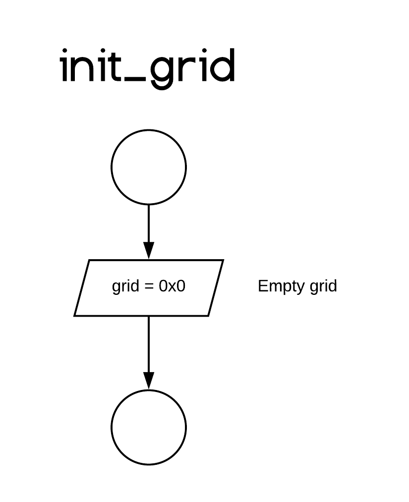

# init_grid
> Source: [core.asm](/src/core.asm)

## Description

Initializes/Empties the tic-tac-toe field by overwriting it's allocated memory with zeros.

init_grid **must** be called before any other core procedure, else the allocated memory may be filled with garbage and procedures will result in undefined behavior.

## C Call
```C
void init_grid();
```

## C Example

```C
#include "core.h"

int main()
{
    init_grid();
    // Handle grid here...
    return 0;
}
```

## Assembly Example

```asm
main:
call init_grid
```

## Procedure Diagram

The diagram may be viewed online [here](https://www.lucidchart.com/invitations/accept/07152f13-30bb-43b1-8e44-199bdf4b9f2f)


