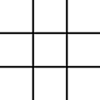
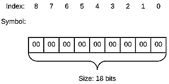
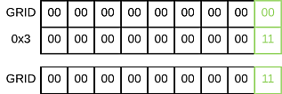

# set_field
> Source: [core.asm](https://github.com/CTXz/x86_64-Assembly-Tic-Tac-Toe/blob/master/src/core.asm#L162)

## Description

Sets the state of the field at position x and y.

## Parameters
|Register|Description                                  |
|--------|---------------------------------------------|
|RDI     |X Co-ordinates                               |
|RSI     |Y Co-ordinates                               |
|RDX     |State, where `0x0` = Circle and `0x1` = Cross|

## C Call
```C
void set_field(uint8_t x, uint8_t y, bool state);
```

## C Example

In the following example, the center field is set to a cross:

```c
if (get_field(1, 1) == EMPTY) // EMPTY is enumerated in core.h!
{
  set_field(1, 1, true);
}
```

## Assembly Example

In the following example, the center field is set to a cross:


```asm
mov   RDI, 0x1    ; x = 1
mov   RSI, 0x1    ; y = 1
mov   RDX, 0x1    ; set state to cross
call  set_field   ; Call procedure
```

## Procedure Diagram

Full diagram may be accessed [here](https://www.lucidchart.com/documents/view/f5cf95c1-2975-4312-8273-2755f62b33bc)


## Procedure Overview

set_field fetches the state of the field assigned to the provided x and y co-ordinates. This is achieved by first converting the x and y co-ordinates into a index, thereby obtaining the position of the specified field on the 18 bit data structure.

The field index is calculated by the following equation:


With the index calculated, we then compute an OR operand that will set the state of the bits representing the field at the index.

The equation that computes the OR operand takes two values:

- The initial quantity, *a*, which is determined by the shape to which the field is set.
- The index *i*, which has already been computed from the x and y co-ordinates.

 The initial quantity *a* is set to `0x1` for circles (`cross = false`) and `0x3` for cross (`cross = true`).


With the operand returned, a bitwise OR instruction is applied against the grid, which sets the field to the desired state.

---

To further explain, the following example is guided by an illustration:
In the following grid, we will set the top left field to a circle:



If we replace fields with their corresponding binary data structures, a 2d grid would manifest its information as it follows:


The 2d grid would translate to the following 18 bit data structure:



To set the state of the top left field, an bitwise OR operation is applied, where `0x3` is the bit mask to set the top left field of the grid:



The data structure would now yield the following 2d grid:


